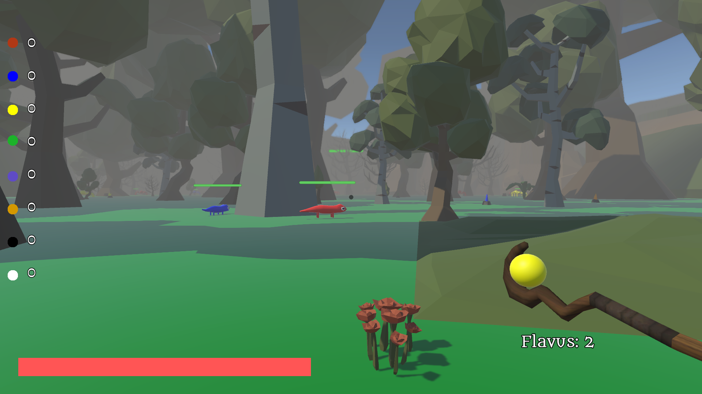
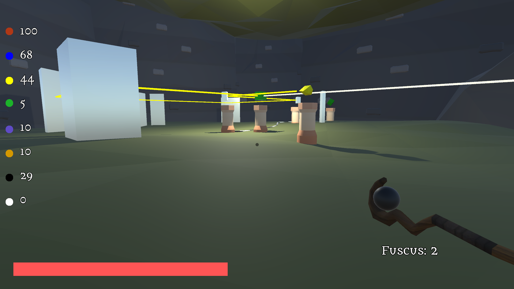

# A 3D Videogame in Unity: Opus Chromaticum

This video game is the project for the course Video Game Programming of the master degree in computer science (University of Udine).   
It was developed with Giacomo Colussi (Github: GiacomoColussi)   
The video game is in Italian and had to be developed following a specific outline. In this case, the outline was Colour Alchemy. 

## Genre and brief description 
It a first person shooter but also a an exploration game and puzzles. You're an alchemist on a mission in order to save the world. During your journey you will learn to synthesize the colors and use them to defeat enemies and resolve environmental puzzle.